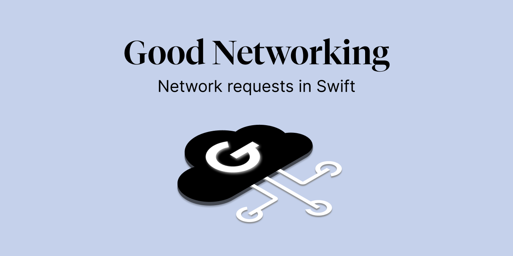

# GoodNetworking

[]() 
[](https://docs.swift.org/swift-book/)
[]()
[]()
[](#swiftpackagemanager)

GoodNetworking is a powerful Swift library designed to simplify HTTP networking by leveraging the capabilities of Swift’s concurrency model, Combine, and Alamofire. It provides a flexible and easy-to-use API for handling complex network operations, making it easier to perform tasks such as sending requests, downloading, and uploading data.

Key Features

    • NetworkSession: A powerful and flexible mechanism for managing HTTP sessions, providing built-in support for sending requests, downloading, and uploading files. It uses a session provider to handle session configuration and lifecycle management.

    • Request Validation: Support for validating responses using custom validation providers.

    • Flexible Endpoint Handling: Define your own endpoint configurations with ease, allowing for a clean and maintainable way to manage network requests.

## Documentation
Check out GoodNetworking documentation [here](https://goodrequest.github.io/GoodNetworking/documentation/goodnetworking/)

## Installation
### Swift Package Manager

Create a `Package.swift` file and add the package dependency into the dependencies list.
Or to integrate without package.swift add it through the Xcode add package interface.

[//]: <> (Don't forget add the version once available.')
```swift
import PackageDescription

let package = Package(
    name: "SampleProject",
    dependencies: [
        .package(url: "https://github.com/GoodRequest/GoodNetworking" from: "addVersion")
    ]
     targets: [
        .target(
            name: "Sample Target",
            dependencies: [
                .product(name: "GoodNetworking", package: "GoodNetworking"),
            ],
        ),
    ]
)
```

## Usage

### Quick start session
Create an session actor best handled with dependency injection pattern
```swift
extension NetworkSession {

    static var sampleSession: NetworkSession(baseUrl: "https://reqres.in/api")

}
```

Create a sample endpoint
```swift
import GoodNetworking

enum SampleEndpoint: Endpoint {

    case singleUser(id: Int)

    var path: String {
        switch self {
        case .singleUser(let id):
            "users/\(id)"
    }

}
```

Create a viewmodel where you call the async function to fetch the user.
```swift
@MainActor
final class UserProfileViewModel {

    var userProfile: Result<User, Error>!

    func fetchUser() async {
        do {
            let result: User = try await NetworkSession.sampleSession.request(endpoint: SampleEndpoint.singleUser(id: 1))
            userProfile = .success(result)
        } catch {
            userProfile = .failure(error)
        }
    }

}

```
### Rich sample session
Ofcourse the is much more

Our session works with alamofire session wrapping it easy to use.

### Initilize session
There are 3 different initializers for our session

You can initilize with the parameter `baseUrlProvider` comforming to `BaseUrlProviding` protocol serving as `baseUrl` to your API calls where `String` is overloaded comform to it so any string `baseUrl` will work, but you can also provide more intricate logic that handles runtime `baseUrl` swapping.

The next parameter `sessionProvider` similarly to the first one as by default works with a `DefaultSessionProvider` that holds just a session with a default `UrlSessionConfiguration` so you can omit it, but you can also user `DefaultSessionProvider`'s configuration init parameter and provide your own `NetworkSessionConfiguration`.
The other initializers serve as convenience to initializer these 2 values indirectly through other types.

Default
```swift
    public init(
        baseUrlProvider: BaseUrlProviding? = nil,
        sessionProvider: NetworkSessionProviding = DefaultSessionProvider(configuration: .default)
    ) {
        self.baseUrlProvider = baseUrlProvider
        self.sessionProvider = sessionProvider
    }
```
Backwards compatibility for our older projects
```swift
    public init(
        baseUrl: BaseUrlProviding? = nil,
        configuration: NetworkSessionConfiguration = .default
    ) {
        self.baseUrlProvider = baseUrl
        self.sessionProvider = DefaultSessionProvider(configuration: configuration)
    }
```
Customizable session if you need more than just the basic session parameters provided by `NetworkSessionConfiguration`
```swift
    public init(
        baseUrlProvider: BaseUrlProviding? = nil,
        session: Alamofire.Session
    ) {
        self.baseUrlProvider = baseUrlProvider
        self.sessionProvider = DefaultSessionProvider(session: session)
    }
```

### Requests in views

With this library you can directly call the request and update the state for a more straithforward way to update the UI

```swift
import Alamofire
import GoodNetworking
import SwiftUI

struct UserScreen: View {

    @State private var user = Resource(session: .sampleSession, remote: RemoteUser.self)

    let userId: Int

    var body: some View {
        ScrollView {
            VStack(spacing: 24) {
                userView(user: user.state)
            }
            .padding()
        }
        .refreshable {
            try? await user.read(forceReload: true)
        }
        .task {
            try? await user.read(request: UserRequest(id: userId))
        }
    }

    private func loadingView() -> some View {
        HStack(spacing: 8) {
            ProgressView()
            Text("Loading...")
        }
    }

    @ViewBuilder private func userView(user: ResourceState<User, NetworkError>) -> some View {
        switch user {
        case .idle:
            Text("Resource idle")

        case .loading:
            HStack(spacing: 8) {
                ProgressView()
                Text("Loading...")
            }

        case .failure(let e):
            Text(e.localizedDescription)

        case .available(let user):
            let fields = [
                "ID", "First name", "Last name", "Email"
            ]
            let values = [
                String(user.id), user.firstName, user.lastName, user.email
            ]

            LazyVGrid(columns: [GridItem(), GridItem()]) {
                ForEach(Array(zip(fields, values)), id: \.0) { field, value in
                    Text(field)
                    Text(value)
                }

                Text("Avatar")

                AsyncImage(url: user.avatar)
                    .aspectRatio(1, contentMode: .fit)
            }

        default:
            Text("Unknown state")
        }
    }

}
```

And you define yourself a model

```swift
struct User: Codable {

    var id: Int
    var email: String
    var firstName: String
    var lastName: String
    var avatar: URL?

}

struct UserRequest: Encodable {

    let id: Int

}

struct UserResponse: Decodable {

    let data: User

}

extension User: Placeholdable {

    static let placeholder: User = User(
        id: 0,
        email: "empty@example.com",
        firstName: "John",
        lastName: "Apple",
        avatar: nil
    )

}

struct RemoteUser: Readable {

    typealias Resource = User
    typealias ReadRequest = UserRequest
    typealias ReadResponse = UserResponse

    nonisolated static func endpoint(_ request: ReadRequest) throws(NetworkError) -> Endpoint {
        SampleEndpoint.singleUser(id: request.id)
    }

    nonisolated static func request(from resource: Resource?) throws(NetworkError) -> ReadRequest? {
        guard let resource else { throw .missingLocalData }
        return UserRequest(id: resource.id)
    }

    nonisolated static func resource(from response: ReadResponse) throws(NetworkError) -> Resource {
        response.data
    }

}
```
And voila, all is setup. You can update the user directly with a state variable. The library also support all the CRUD operations with protocols `Creatable`, `Readable`, `Updatable`, `Deletable` and also more like `Listable` for pagination of lists. 

## License
GoodNetworking is released under the MIT license. See [LICENSE](LICENSE.md) for details.
